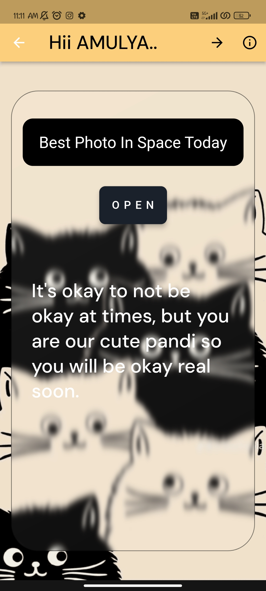
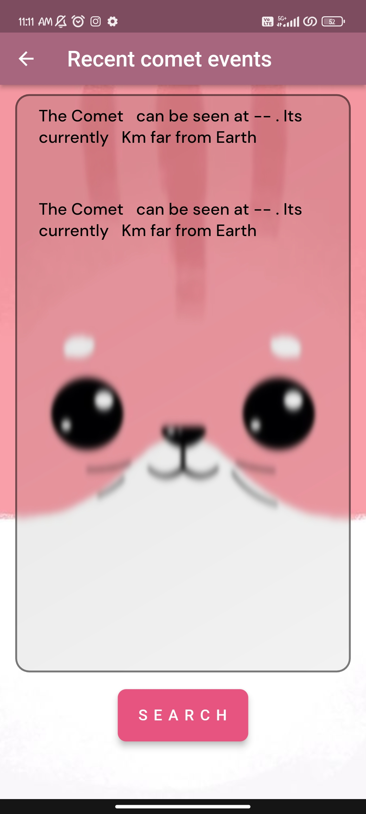
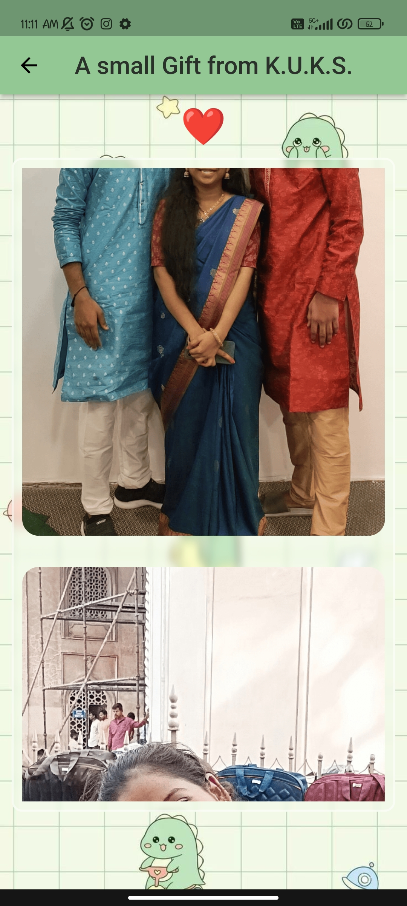

# Celebratemate

A special app created as a birthday gift for my friend. Celebratemate includes a To-Do list, a list of images, and integrates with NASA APIs to display the best space photo of the day and recent comet events. The app uses a Flask application as a middleware for handling API calls.

## Features

- To-Do List: Keep track of tasks.
- Image Gallery: Display a curated list of images.
- NASA APIs:
  - Best Space Photo of the Day
  - Recent Comet Events
- Glassmorphism UI: Stylish and modern interface.

## Technologies Used

- **Flutter**: For building the mobile application.
- **Flask**: As a middleware for handling API calls.

## Packages Used

- `flutter`: SDK for building the app.
- `glassmorphism`: ^3.0.0 for implementing glassmorphism UI.
- `http`: ^1.1.0 for making HTTP requests.
- `url_launcher`: ^6.2.1 for launching URLs.
- `path_provider`: ^2.1.1 for finding commonly used locations on the filesystem.
- `flutter_image`: ^4.1.10 for image loading.
- `google_fonts`: ^6.1.0 for using Google Fonts.
- `flutter_launcher_icons`: ^0.13.1 for customizing app launcher icons.
- `shared_preferences`: ^2.2.2 for persistent storage.

## Installation

1. **Clone the repository:**

    ```sh
    git clone https://github.com/yourusername/celebratemate.git
    cd celebratemate
    ```

2. **Install dependencies:**

    ```sh
    flutter pub get
    ```

3. **Run the app:**

    ```sh
    flutter run
    ```

## Setup Flask Middleware

1. **Navigate to the `middleware` directory:**

    ```sh
    cd middleware
    ```

3. **Run the Flask server:**

    ```sh
    python app.py
    ```
    update the ports in the flutter code

## Usage

- **To-Do List**: Add, update, and delete tasks.
- **Image Gallery**: Browse through a list of pre-selected images.
- **NASA APIs**:
  - View the best space photo of the day.
  - Get information about recent comet events.

## Screenshots






---

Happy Birthday to my dear friend!
